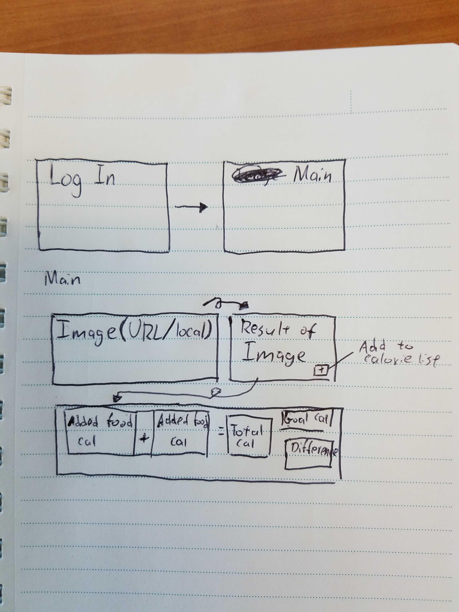

# Calorie Watch

## Heroku Link

You can find this app on <https://calorie-watch.herokuapp.com/>.

## About this App

This app is all about watching what you eat and keeping track of what you are eating throughout the day. Take a picture of your food and upload it onto the app. The app will ask you to confirm what you have eaten and will take the calories of that food and add it to your list of eaten food. It will add up all calories of the food you have eaten and tell you if you have gone over your calorie goal or tell you how many calories you have left for the day.

## Flowchart of App

